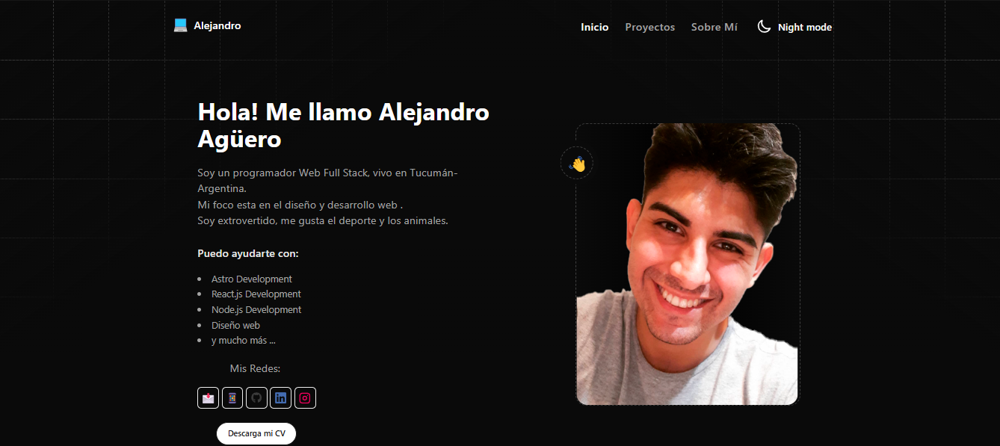

# Hola! soy Alejandro Agüero🚀

### Soy un desarrollador frontend de Tucumán, Argentina. Me apasiona crear nuevas soluciones tecnológicas demostrando así mi creatividad y desempeño.🤖

#### Comencé con la programación desde que tengo 14 años de edad , cuando me regalaron mi primera computadora💻. Desde entonces supe que me iba a dedicar a la tecnología. Pasaron los años y en secundaria fue mi primer acercamiento con la programación al aprender un poco de HTML y CSS✨.

#### También estuve en una carrera de ingeniería, pero no me llevó por el lado que más me gustaba. Luego de eso, comencé a aprender por mi cuenta a programar y fue ahí donde encontré un vasto mundo de lenguajes y frameworks, entre todo eso descubrí mi inclinación hacia el Front-end y el diseño web🧑🏻‍💻.

#### Pero no soy solo nerdeadas y código. Soy alguien extrovertido, deportista, me gustan mucho los animales; dato de color: tengo un perro que se duerme parado🐕. Me gustan mucho las actividades al aire libre, como hacer trekking, navegar en kayak🚣🏻‍♂️ o participar de juegos en altura como arbolismo.

